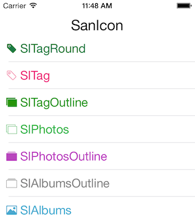

# SanIcon
Selected icon font from IonIcon, Font Awesome, Entypo... In Objective-C.



## Getting Started
A. Copy SanIcon into your project.

B. Info.plist Settings. Add "Fonts provided by application" item by clicking on the "+" icon, then set "Item 0" with value "sanicon.ttf".

## Sample Code

#### Use `SanIcon` with `UILabel`:

```objective-c
#import "SanIcon.h"

UILabel *label = [[UILabel alloc] init];
label.text = [NSString sanicon:SIClock];
label.font = [UIFont saniconFontOfSize:20.f];
```
Also work with `UIButton`, ...

#### Use `SanIcon` with `SILabel`

```objective-c
#import "SILabel.h"

SILabel *label = [[SILabel alloc] init];
label.text = @"Albums";
label.iconName = SIAlbums;
label.iconColor = 0xffaa99ff;
label.iconSize = 22.f;
label.iconPadding = 5.f;
```

## Reference
* [Complete icon List](http://sanfriend.com/lab/sanicon)

## License
MIT License.
